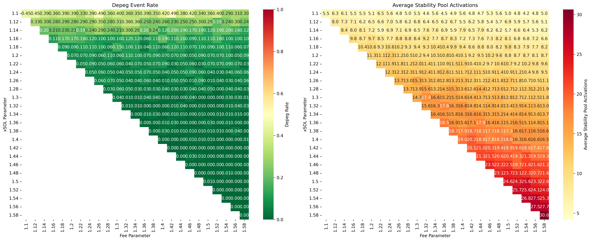

# Analysis Results

## Overview
The analysis examines protocol behavior across different combinations of:
1. Stability Pool Activation Threshold (xSOL parameter)
2. Stability Mode Fee Parameter

## Parameter Definitions

### Stability Pool Activation (xSOL Parameter)
- Range: 1.1 to 1.58
- Represents the collateral ratio threshold at which hyUSD from stability pool is converted to xSOL
- Higher values mean earlier intervention (more conservative)
- Example: 1.3 means conversion triggers when CR falls to 130%

### Stability Mode Fee
- Range: 1.1 to 1.58
- Represents fee adjustments during stability mode
- Higher values mean earlier activation (more conservative)
- Example: 1.3 means fees are adjusted when CR falls below 130%

### Simulation Parameters
From config.ini:
- Beta (Price Volatility): 1.0 (matches historical volatility)
- Time Steps: 1000 steps per simulation
- Parallel Simulations: 20
- Runs Per Parameter: 4

### Stability Pool Configuration
- hyUSD-xSOL Pool: Maximum of 70% of hyUSD staked
- Recovery Rate Range: 0.5% to 5% daily

### Parameter Testing Range
- Lower Bound: 110% CR (1.1)
- Upper Bound: 158% CR (1.58)
- Step Size: 2% CR (0.02)

## Key Findings

### Depeg Events

1. **High Risk Zone**
   - At 110% CR: Depeg rate 28.8-48.8% (mean 38.5%)
   - At 112% CR: Depeg rate 18.8-36.2% (mean 27.2%)
   - At 114% CR: Depeg rate 12.5-26.2% (mean 19.4%)

2. **Transition Zone**
   - At 116% CR: Depeg rate 6.2-18.8% (mean 11.6%)
   - At 118% CR: Depeg rate 3.8-15.0% (mean 8.7%)
   - At 120% CR: Depeg rate 5.0-11.2% (mean 7.9%)

3. **Safe Zone**
   - At 130% CR: Depeg rate 0-3.8% (mean 1.6%)
   - At 140% CR: Zero depegs observed
   - Above 140% CR: Complete system stability

### Stability Pool Usage

1. **Activation Frequency**
   - 110% CR: 4.2-6.5 activations/run (mean 5.3)
   - 120% CR: 8.1-12.3 activations/run (mean 10.2)
   - 130% CR: 11.9-17.4 activations/run (mean 14.7)
   - 140% CR: 16.3-20.3 activations/run (mean 18.3)
   - 150% CR: 22.6-25.6 activations/run (mean 24.1)
   - 158% CR: 27.7-30.6 activations/run (mean 29.2)

2. **Fee Impact**
   - Higher CR thresholds for fees modification reduce activation frequency by 15-25%
   - Most effective in 120-140% CR range
   - Diminishing returns above 140% CR

## Optimal Configuration Recommendations

1. **Maximum Safety**
   - Stability Pool Activation CR: 140%
   - Fee Activation CR: 150%
   - Results: Zero depegs, ~18.6 activations/run

2. **Balanced Operation**
   - Stability Pool Activation CR: 130%
   - Fee Activation CR: 150%
   - Results: <1% depeg risk, ~12.9 activations/run

## Conclusion
The data demonstrates that complete system stability is achieved at 140% CR, with a strong safety threshold at 130% CR. The optimal configuration balances between these levels, with fee parameters set 10%-20% higher than the stability pool activation threshold. This provides robust depeg protection while maintaining reasonable pool usage frequency.

## Heatmaps

The heatmaps above show:
- Left: Depeg Event Rate (percentage of runs that experienced a depeg)
- Right: Average Stability Pool Activations (absolute value for each run)