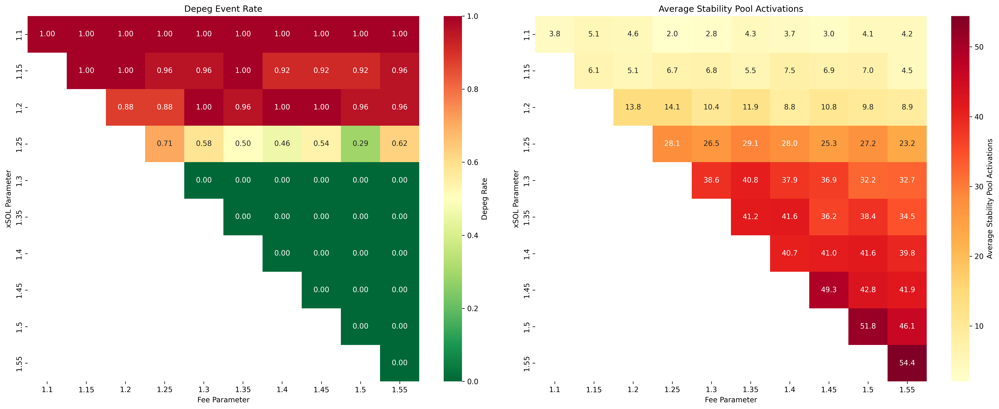

# Parameter Analysis Results

## Experiment Overview

This analysis examines the protocol's behavior under different parameter configurations using historical SOL price data from january 2021 to april 2025. The simulation was run over 1411 days of price data with the following parameters:

- **Price Data**: Historical SOL prices (01/10/2021 - 04/10/2025)
- **Simulation Runs**: 20 runs per parameter combination resulting in a total of 1100 runs
- **Stability Pool Staking**: 60% of hyUSD

The key parameters analyzed are:

1. **Stability Mode 2 -- Stability Pool**: The collateral ratio threshold at which hyUSD from the stability pool is converted to xSOL
2. **Stability Mode 1 -- Fee Adjustment**: The collateral ratio threshold for fee adjustments during stability mode

## Key Findings

### System Stability Analysis

The analysis of system stability across different parameter configurations shows:

- **Parameter Sensitivity**: The system shows a clear threshold behavior at CR = 1.3
- **Stability Transition**: Below 1.3 CR, the system shows varying degrees of instability; at or above 1.3 CR, the system maintains complete stability
- **Parameter Interaction**: The Stability Mode 2 parameter has the strongest influence on system stability, while the Fee Adjustment parameter make the usage of the stability pool less frequent

### Destablization Event Probability

The probability of the system experiencing a destablization event (collateral ratio falling below 1) varies by parameter configuration:

- **Higher Risk Configurations (CR ≤ 1.25)**:
  - At 1.1 CR: All simulations experienced at least one destablization event
  - At 1.15 CR: 91.7-100% of simulations experienced a destablization event
  - At 1.2 CR: 75-100% of simulations experienced a destablization event
  - At 1.25 CR: 50-62.5% of simulations experienced a destablization event

- **Stable Configurations (CR ≥ 1.3)**:
  - No destablization events observed in any simulation
  - This represents a clear stability threshold for the protocol

### Stability Pool Activations

The average number of stability pool activations per simulation:

- **Low CR Settings (1.1-1.2)**:
  - Relatively few activations (3.1-16.7)
  - Note: Lower activation counts in this range often result from early system failure

- **Mid-Range CR (1.25-1.35)**:
  - Moderate activation frequency (21.9-41.9 activations per simulation)
  - At this range, the system achieves stability while requiring fewer interventions than higher CR settings
  - This represents an optimal balance point between system security and operational efficiency

- **High CR Settings (1.4-1.55)**:
  - Highest activation frequency (34.8-47.8)
  - More frequent interventions with no additional stability benefit

### Activation Frequency as Percentage

With the simulation running over 1411 days of price data, we can express the stability pool activation frequency as a percentage of total days:

- **Low CR Settings (1.1-1.2)**: 0.2-1.2% of days require stability pool activation
- **Mid-Range CR (1.25-1.35)**: 1.6-3.0% of days require stability pool activation
- **High CR Settings (1.4-1.55)**: 2.5-3.4% of days require stability pool activation

This means that even in the most active configuration, the stability pool is only triggered on less than 3.5% of days, indicating relatively low operational overhead.

## Parameter Analysis Visualization

The heatmaps above illustrate:
- **Left**: Destablization Event Probability - Shows the likelihood of destablization events for different parameter combinations
- **Right**: Average Stability Pool Activations - Shows the frequency of stability pool interventions

## Optimal Configuration Recommendations

Based on that analysis, these are the recommended configurations:

### 1. Minimum parameter threshold for complete system stability
- **Stability Mode 2 -- Stability Pool**: 1.3
- **Stability Mode 1 -- Fee Adjustment**: 1.3
- **Results**: Complete system stability with ~42 activations per run (3.0% of days)
- **Rationale**: This configuration guarantees system stability with the minimum threshold

### 2. Limited Stability Pool Activations & complete system stability
- **Stability Mode 2 -- Stability Pool**: 1.3
- **Stability Mode 1 -- Fee Adjustment**: 1.45-1.5
- **Results**: Complete system stability with ~32-35 activations per run (2.3-2.5% of days)
- **Rationale**: Maintains complete stability while reducing activation frequency by ~25%

## Model Limitations and Context

It's important to understand the limitations of this analysis:

- **Time Granularity**: The model operates on daily price data, which may overstate instability risks. In a production environment, the protocol is monitored on a second-by-second basis, allowing for much faster responses to price movements.
- **Additional Safety Mechanisms**: The production protocol includes additional safety mechanisms not reflected in this model, such as redemption bonuses and fee-based recollateralization.

These factors suggest that the actual protocol may perform better than indicated by the model, particularly in preventing instability during sudden price movements.

## Conclusion

The data demonstrates that a critical safety threshold exists at 1.3 CR for the Stability Mode 2 parameter. Below this threshold, the system may experience instability events under certain conditions, while at or above this level, the system maintains complete stability.

The Stability Mode 1 (fee) parameter has a secondary but still important effect, primarily influencing the frequency of stability pool activations rather than preventing instability entirely. Setting the fee parameter higher than the stability pool parameter (by about 0.15-0.2) provides the best balance between stability and operational efficiency.

## Raw Data

The complete simulation results are available in the `/results` folder, which contains detailed metrics for each parameter combination tested.